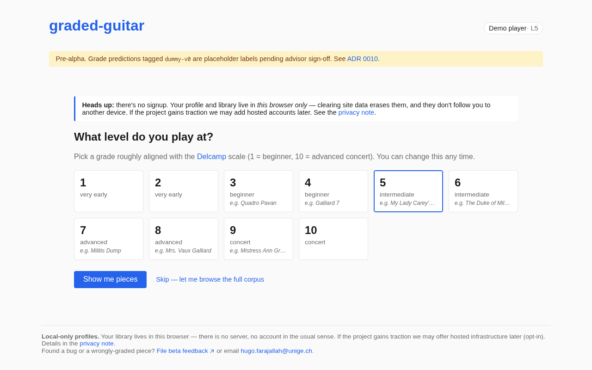
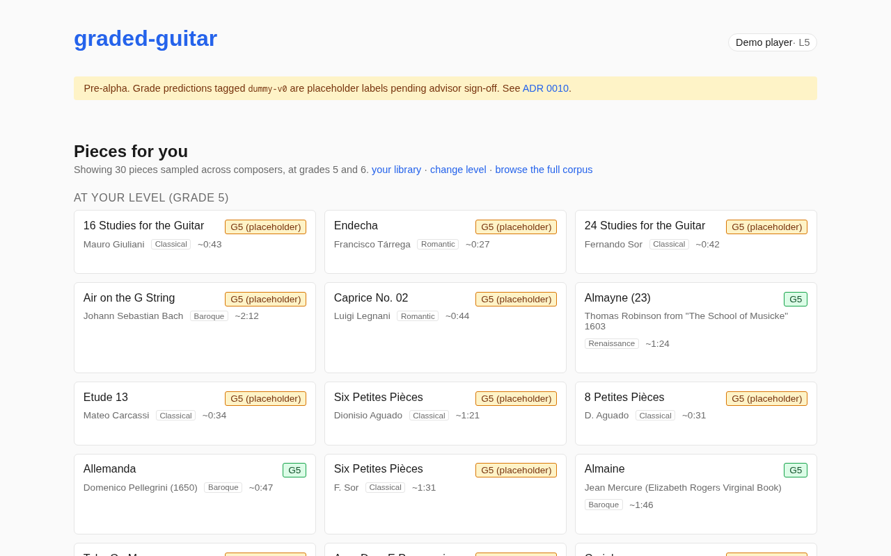
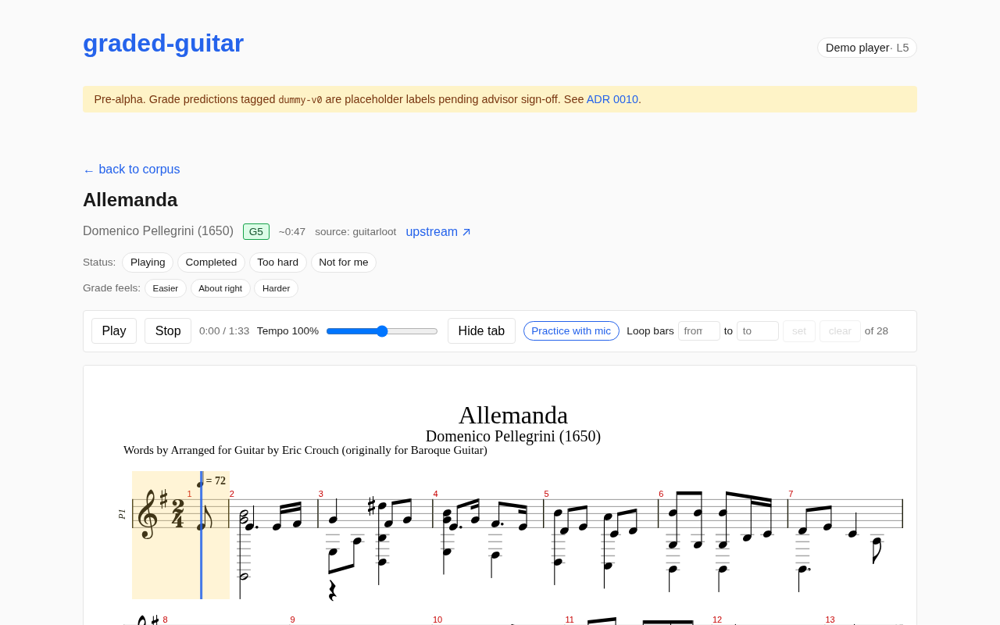
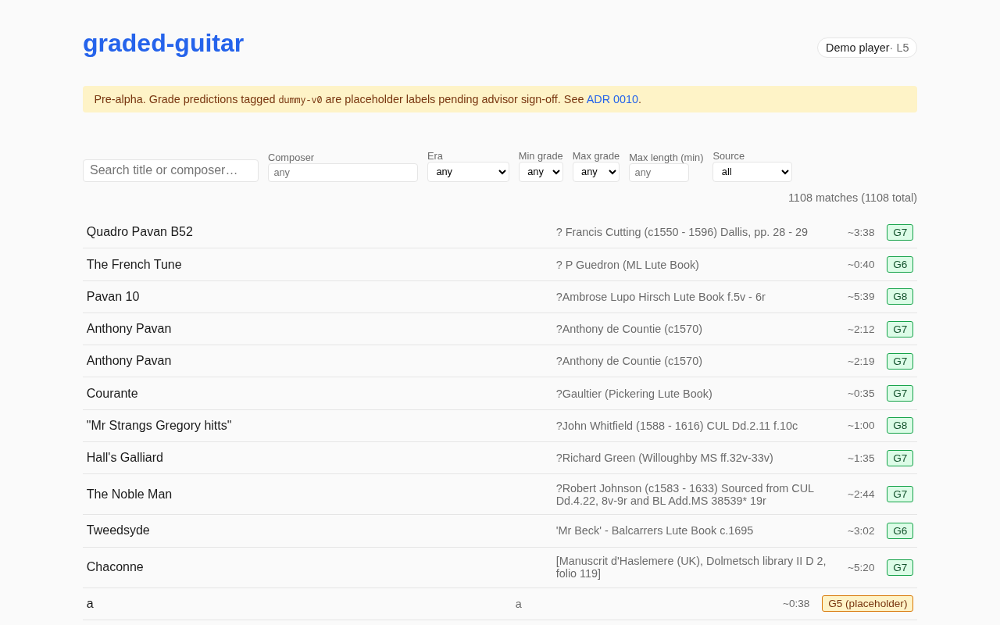

# graded-guitar

**A free, open-source web platform where classical guitarists find sheet music they can actually play.**

Every score in the library is automatically graded by difficulty, so a player declares (or is placed at) a level and gets a feed of pieces matched to that level — not an undifferentiated wall of search results.

> **Status:** Pre-alpha. M0–M3 scaffolded; M4 (discovery feed) and M5 (local-only profiles) landed; M6 (closed beta) infrastructure in place pending advisor sign-off. Local-only; not yet deployed. See [`project-spec.md`](./project-spec.md) §7 for the milestone definitions.

> ⚠ **All grade predictions in this repo are produced by `dummy-v0`**, a placeholder model trained on Delcamp grades plus synthetic advisor labels generated by [`scripts/m2_dummy_advisor.py`](./scripts/m2_dummy_advisor.py). They exist so the M2 → M3 pipeline can be built end-to-end while the musical advisor is being engaged. **Do not treat any `model_grade` field as advisor-blessed until `model_grade_source` no longer starts with `dummy-`.** See [`decisions/0010-m2-close-with-dummy-labels.md`](./decisions/0010-m2-close-with-dummy-labels.md).

[`project-spec.md`](./project-spec.md) is the full, authoritative specification — everything else in this repo is governed by that document.

---

## The user journey

### 1. Declare your level

The user picks a grade on the Delcamp 1–10 scale, with one curator-graded example per level as a sanity check.



### 2. Get a personalized feed

The feed shows pieces at the declared level and one above ("stretch"), sampled across composers so a single arranger (or a single Renaissance lutenist) can't dominate it.



### 3. Play any piece in the browser

Standard-notation rendering (alphaTab), optional tab, playback, tempo slider, A/B loop. No editor. No upload. No audio listening. Just a practice surface over the corpus.



### 4. …or browse the whole corpus

Search and filter by composer, era, length, grade or source.



The corpus today contains **1108 accepted pieces** from four sources — Guitar Loot (428, Renaissance/Baroque), Mutopia (332), PDMX/Zenodo (307), and various GitHub repos (~41). Top composers include Felix Horetzky, Tárrega, Dowland, Giuliani, Sor and Carcassi. Full breakdown in [`corpus/report.md`](./corpus/report.md).

---

## Quickstart

### Repo self-check

```bash
git clone git@github.com:HugoFara/graded-guitar.git
cd graded-guitar
./scripts/check.sh   # same checks CI runs: required files + syllabi schema + M1/M2 regression tests
```

`scripts/check.sh` expects a Python environment with `lxml` and `sklearn` available — there's a `.venv/` convention in the project (see `requirements.txt`). The M1 ingest pipeline scripts under `scripts/m1_*.py` are the canonical way to (re-)build the corpus; see [`corpus/README.md`](./corpus/README.md).

### Running the web player locally

The M3 web app lives under [`web/`](./web/). It reads `corpus/manifest.json` and the normalized MusicXML files as static assets, so the M1 pipeline has to have been run first.

```bash
cd web
pnpm install
pnpm dev              # http://localhost:5173
```

The `predev` script mirrors `corpus/manifest.json` and `corpus/normalized/` into `web/public/` — both are gitignored. Stack rationale (alphaTab + Svelte 5 + Vite) is in [`decisions/0011-m3-stack.md`](./decisions/0011-m3-stack.md).

### Re-capturing the screenshots above

The README screenshots come from a Playwright spec that drives the built preview:

```bash
cd web
pnpm build
pnpm test:e2e screenshots   # writes docs/screenshots/*.png
```

---

## How this project is built

We follow the milestones in [`project-spec.md`](./project-spec.md) §7 in order. Each milestone has explicit validation checks; we don't advance until they pass. When we make a meaningful technical choice, we record it as an ADR under [`decisions/`](./decisions/).

| Milestone | Goal | Status |
| --- | --- | --- |
| **M0** Foundation | License, syllabi, advisor scoping, CI | scaffolded |
| **M1** Ingest pipeline | Public-source → normalized MusicXML | 1108 pieces, advisor spot-check pending |
| **M2** Grading model | Difficulty grade per piece | closed with placeholder `dummy-v0` labels ([ADR 0010](./decisions/0010-m2-close-with-dummy-labels.md)) |
| **M3** Web player | Notation render + playback in browser | v0.1 scaffold landed |
| **M4** Feed | Level-aware piece discovery | feed + browse + filters implemented |
| **M5** Accounts | Per-piece status & library | local-only profiles ([ADR 0012](./decisions/0012-m5-local-accounts.md)) |
| **M6** Closed beta | Real guitarists exercising the platform | invite template + feedback form + triage runbook in place; awaiting advisor sign-off |
| **M7** Public launch | Open sign-up, docs, monitoring | not started |

If you disagree with a decision, open an issue or a PR against the relevant ADR — don't silently diverge.

---

## What's in here today

| Path                  | Purpose                                                                |
| --------------------- | ---------------------------------------------------------------------- |
| `project-spec.md`     | Authoritative product spec. Read this first.                           |
| `decisions/`          | Architecture Decision Records. One file per meaningful choice.         |
| `syllabi/`            | Structured grade-list data for RCM, Trinity, ABRSM.                    |
| `docs/`               | Advisor agreement template, M2 advisor packet, M6 beta invite & triage. |
| `docs/screenshots/`   | The PNGs embedded above.                                               |
| `scripts/`            | M1 ingest pipeline (`m1_*.py`), M2 grading model (`m2_*.py`), CI checks. |
| `corpus/`             | M1/M2 output: manifest, normalized MusicXML, reports. See [`corpus/README.md`](./corpus/README.md). |
| `web/`                | M3+M4+M5 web player (Svelte 5 + Vite + alphaTab).                      |
| `experiments/`        | Source-diversification spike artifacts (see [ADR 0017](./decisions/0017-lilypond-spike-closed.md)). |
| `.github/`            | CI workflows and the beta-feedback issue form.                         |

---

## Contributing

See [`CONTRIBUTING.md`](./CONTRIBUTING.md). The short version: this project values pedagogical correctness above technical elegance — see spec §5 and §6 — and we are intentionally narrow in scope (classical guitar only, no editing, no OMR, no audio listening; see spec §4).

**Have classical-guitar MusicXML you've typeset?** The corpus skews Renaissance/Baroque (see [`decisions/0014-corpus-diversification-frontier.md`](./decisions/0014-corpus-diversification-frontier.md), revisited by [`decisions/0015-omr-feasibility-spike.md`](./decisions/0015-omr-feasibility-spike.md) which added the PDMX source, and [`decisions/0017-lilypond-spike-closed.md`](./decisions/0017-lilypond-spike-closed.md) which closed the LilyPond-on-GitHub lead); modern repertoire, contemporary arrangements, and conservatory editions are all welcome. Open an issue or email <hugo.farajallah@unige.ch>.

## License

MIT. See [`LICENSE`](./LICENSE) and [`decisions/0001-license-mit.md`](./decisions/0001-license-mit.md) for rationale.
